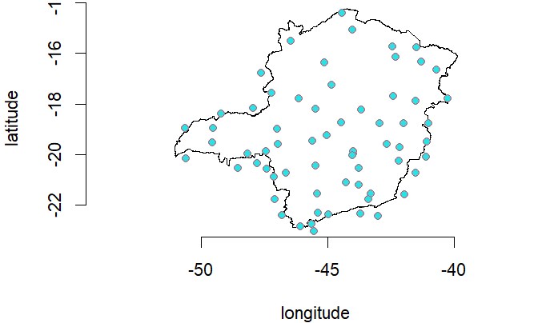
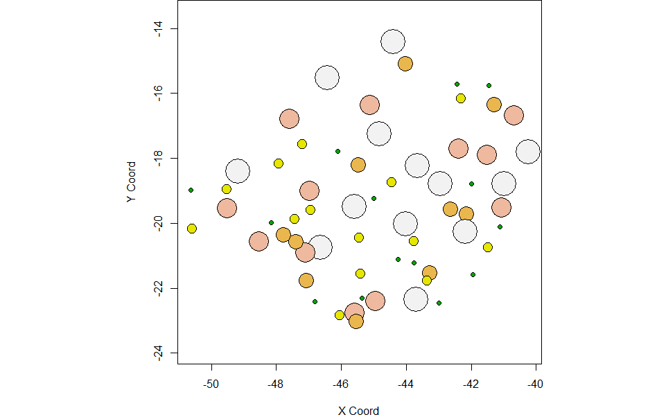
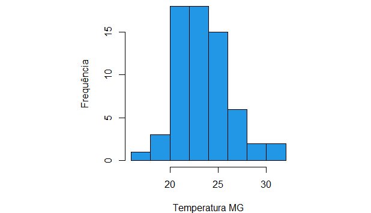
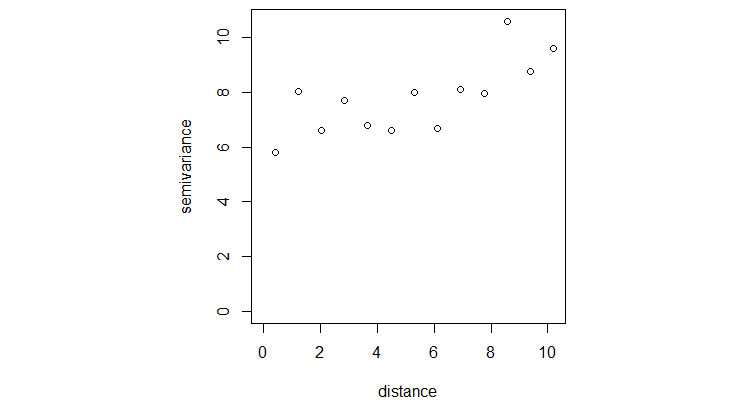
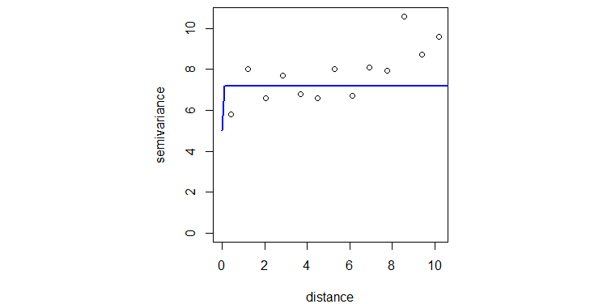
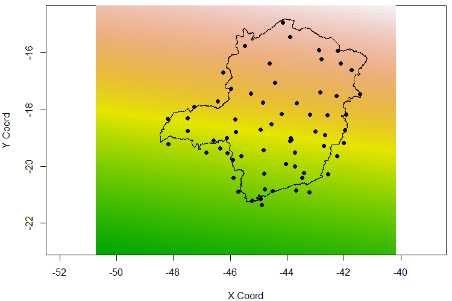
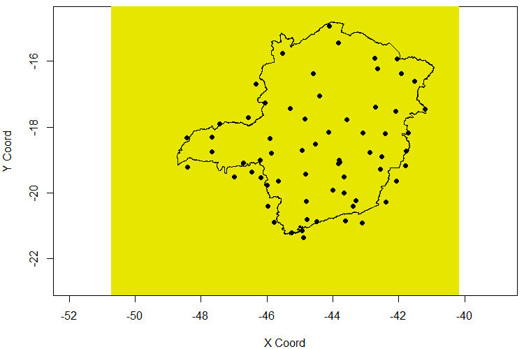

```{r echo=FALSE, warning=FALSE}
knitr::opts_chunk$set(message = FALSE,
                      warning = FALSE,
                      echo = FALSE,
                      include = FALSE)

htmltools::img(src = knitr::image_uri("logoUffAzulTransparente.png"), 
               alt = 'logo', 
               style = 'position:absolute; top:10px; right:0; padding:5px;width: 150px; height: 80px')

library(pacman)
p_load(char = c("raster", 
                "readxl",
                "geoR",
                "rgdal",
                "gstat",
                "sp")) 

setwd("~/Etatistica/2021.2/ESTATÍSTICA ESPACIAL I/Desafio 2/bases")

```

<div style="text-align: justify">

# Objetivo

  O conceito de medir a temperatura é relativamente novo. O termoscópio *(um termômetro sem escala)* foi o precursor do termômetro moderno. Muitos inventores estavam trabalhando em termômetros em 1593, mas o mais conhecido é Galileo Galilei. Um termoscópio poderia mostrar as diferenças de temperatura, permitindo que os observadores soubessem se algo estava ficando mais quente ou mais frio. 
  Com os avanços tecnológicos, podemos hoje em dia não só medir a temperatura do dia, mas também realizar previsões para os dias seguintes. No Brasil, o INMET *(Instistuto Nacional de Metereologia)* que é um órgão do Ministério da Agricultura, Pecuária e Abastecimento, que fornece informações meteorológicas para todo o país. O órgão adota a medição sinótica, ou seja, observada em horários padronizados, e tem termômetros espalhados em um raio de ao menos 50km.
  Nesse estudo, foi utilizado uma base de dados com 65 temperaturas medidas em localidades distintas no estado de Minas Gerais - MG. A partir dessas observações foi realizada uma análise geoestatística para que, possamos verificar o padrão da variabilidade dessas temperaturas de modo que, buscamos verificar os possíveis fatores que relacionam com esses valores medidos.
 
# Análises exploratórias {.tabset .tabset-fade .tabset-pills}

## Parte 1
 O Conjunto de dados utilizado nesse trabalho possui 65 temperaturas observadas e 4 variáveis referentes ao estado de Minas Gerais - MG. A seguir, é apresentado o dicionário das variáveis utilizadas:
 
* Local - local da torre de medida
* Temperatura - temperatura em graus celsius
* Latitude - latitude da torre de medida
* Longitude - longitude da torre de medida
 
## Parte 2
 
 
 Na **Figura 1** podemos observar cada uma das temperaturas medidas, vale notar que cada temperatura está posicionada no mapa de acordo com a localização da torre que mediu a mesma, ou seja, cada ponto representa a temperatura medida naquela torre de medição. Atráves do mapa é possível notar que uma quantidade maior de medições foi realizada na parte sul do estado do que na norte. Na **Figura 2** é apresentado um gráfico de pontos criados a partir dos quantis da amostra, nesse gráfico quanto maior o ponto e  mais branco o mesmo estiver maior é o valor da temperatura observada, em contra partida, quanto menor o ponto e mais pro verde o ponto estiver menor o valor da temperatura. Observamos que as maiores temperaturas parecem estar mais concetradas na região leste do estado de Minas Gerais.


 Por fim, para realizarmos a estimação do modelo, foi verificado se as temperaturas observadas seguem uma distribuição normal, ou se aproximam de uma, na **Figura 3** podemos ver o histograma com desses valores, e a partir dele foi verificado que não precisava ser realizado uma transformação nos dados, tal escolha será validade mais à frente em outra análise.
 
 


# Análise geoestatística {.tabset .tabset-fade .tabset-pills}

 Para realizarmos as análises geoestatísticas primeiro utilizamos o semi-variograma empirico afim de identificar uma família de funções para modelar o semi-variograma paramétrico, assim como, seus parâmetros, depois realizamos a predição espacial atráves da krigagem, por fim utilizamos a validação cruzada para obter um ajuste do modelo criado

## Variograma 

  A estimação do variograma foi utilizada na identificação da família de funções das correlações envolvidas. Para calcular o Variograma uitlizamos a seguinte fórmula
  $$ \gamma(h) = \tau^2 + \sigma^2 [1-\rho(h)]$$
onde:

* $ρ(h)$: função de correlação 
* $\sigma^2$: patamar patamar parcial da variância do processo espacial
sobre a região;
* $\tau^2$: efeito pepita compõe os erros e demais efeitos não captados ao se observar as medidas da variável de interesse;
* $(\tau^2 + \sigma^2)$: patamar de variabilidade total;
* $\phi$: parâmetro associado ao alcance/amplitude da correlação espacial.

 Antes de estimar o variograma em si, foi estimado um variograma empirico afim de identificar uma família que pudesse modelar os dados, assim foi escolhida a família exponencial potência, onde usamos a função de correlação gaussiana, o variograma empirico pode ser observado na **Figura 4**.


  Para estimar os parâmetros do variograma, foi utilizado a estimação por Máxima verossimilhança, logo sob a hipótese de um processo gaussiano com $θ = (\tau^2, \sigma^2,\phi)$ temos que
$$
Y|X, \beta, \theta \sim NMV(X\beta,\Sigma_\theta)
$$
onde:

* $X\beta$ representa a superfície de média $\mu(s)$.
* $\Sigma = \tau^2 In + \sigma^2R_\theta$ é a matriz de covariância, com $R_\theta$ sendo a matriz de correlação com elementos dados por $ρ(.,\theta)$.
 Então, a partir desse método encontramos os parâmetros do variograma apresentado na **Figura 5**, sendo eles: $\tau^2 = 5, \phi = 0.000731721$ e $\sigma^2= 2.18$, esse método também confirmou que não é necessário uma transformação nos dados das temperaturas, assim confirmando a suspeita inicialmente levantada na análise exploratória.



## Krigagem

  A predição espacial, também conhecida como krigagem, é um método para obtenção de previsões do fenômeno de interesse em locais não observados. Essa predição pode ser realizada de diversas maneiras, mas nesse presente estudo foi utilizado a *krigagem simples*.

* A krigagem simples consiste numa substituição de todos os parâmetros desconhecidos
do modelo pelas suas estimativas.

1. construir uma superfície de prediçãao a partir do estimatidor do efeito aleatório com estrutura de correlação espacial $\hat{Z}(s)$;
2. construir uma superfície de variância de predição a partir de $V[\hat{Z}(s|Y]$

* A krigagem simples assume que os parâmetros $\beta$ associados `as covariáveis são conhecidos.

 Na **Figura 6** podemos notar o processo de krigagem dos dados, nesse gráfico quanto mais claro a cor maior o valor da temperatura e quanto mias verde menor ela é, logo assim como levantado anteriormente, podemos notar que as maiores temperaturas foram observadas na região norte do estado, ou seja, a krigagem confirmou nossa hipóteses levantada pela a análise exploratória dos dados.



 Na **Figura 7** temos o gráfico da variância da predição, podemos notar que todo ele está em amarelo, ou seja, temos uma variância alta na nossa predição, o que siginifica dizer que temos uma grande incerteza nos dados preditos.




# Conclusão {.tabset .tabset-fade .tabset-pills}

 O objetivo deste trabalho consistia em realizar uma análise geoestatística sobre os dados da temperatura observada no Estado de Minas Gerais, utilizamos primeiro uma análise exploratória, observando os valores encontrados num mapa do estado, depois um gráfico de pontos dos quantis dos valores também foi utilizado afim de procurar alguma dependência espacial nos dados, um histograma das temperaturas também criado para verificarmos a distribuição que os dados seguiam, a hipótese de normalidade não foi rejeitada.
 Nas análises geoestatística utilizamos o método da máxima verossimilhança para estimar os parâmetros do variograma, bem como a família de funções a que os mesmo pertenciam, foi escolhido a função gaussiana para modelar os dados e com o modelo criado foi possível obter os parâmetros do variograma.
 A krigagem simples foi utilizada para predição espacial, e com os resultados encontrados verificamos que as maiores temperaturas estão na região norte do Estado, porém a variabilidade da predição foi alta, o que nos leva a disconfiar da qualidade dessa predição.
 Um modelo utilizando outra família de funções pode apresentar resultados melhores, ou talvez um processo de predição diferente, como a krigagem ordinária ou a krigagem universal pode nos apresentar resultados mais interessantes.
 